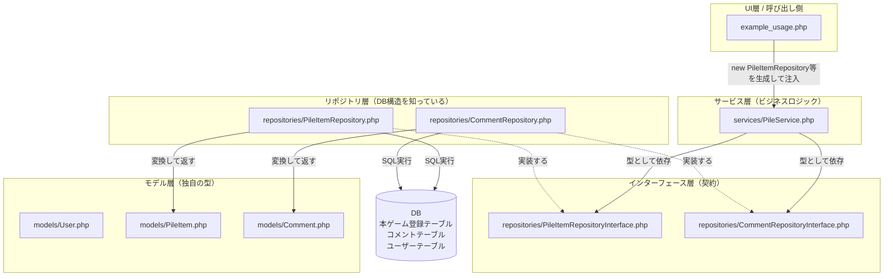
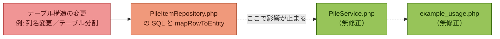

# DB変更に強いアーキテクチャ — ファイル構成ガイド

このドキュメントは、`php-db-resilient/` 配下の各ファイルが「何を担当しているか」と
「DBのテーブル構造が変わったときに、どこを直せばいいか」を整理したものです。

---

## 1. 全体の依存関係図

**読み方**：矢印が実線のものは「使う／依存する」、点線は「インターフェースを実装する」関係です。
`PileService`（サービス層）は実線でインターフェースにしか繋がっておらず、具体的な
`PileItemRepository`（実装クラス）には繋がっていません。これが「DB構造を知らない」状態です。

---

## 2. DBが変わったとき、どこまで影響が伝わるか

赤〜オレンジの箇所（リポジトリ層）だけが修正対象で、緑の箇所（サービス層・呼び出し側）は
**無修正のまま動き続ける**、というのがこの構成の狙いです。

---

## 3. ファイルごとの役割一覧

| ファイル | 役割 | DBのテーブル構造を知っているか |
|---|---|---|
| `models/User.php` | ユーザー1人を表す独自の型。`id`, `name`, `isAdmin`のみ保持 | ❌ 知らない |
| `models/PileItem.php` | 積み（本・ゲーム）1件を表す独自の型 | ❌ 知らない |
| `models/Comment.php` | コメント1件を表す独自の型 | ❌ 知らない |
| `repositories/PileItemRepositoryInterface.php` | 積みデータ取得の「契約」だけを定義。メソッド名と戻り値の型のみ | ❌ 知らない |
| `repositories/CommentRepositoryInterface.php` | コメントデータ取得の「契約」だけを定義 | ❌ 知らない |
| `repositories/PileItemRepository.php` | 実際にSQLを書いて`本ゲーム登録テーブル`にアクセスする実装 | ✅ **唯一知っている場所** |
| `repositories/CommentRepository.php` | 実際にSQLを書いて`コメントテーブル`にアクセスする実装 | ✅ **唯一知っている場所** |
| `services/PileService.php` | 「ユーザーの積み一覧を取る」「コメントしたユーザーの積みを集める」などの業務ロジック。インターフェースの型にしか依存しない | ❌ 知らない |
| `example_usage.php` | PDO接続を作り、リポジトリを実体化してサービスに注入する「組み立て」の場所 | △ 接続情報のみ知っている（テーブル構造は知らない） |

---

## 4. 「テーブル構造が変わったらどうなるか」の具体例

例: `本ゲーム登録テーブル`を `本テーブル` と `ゲームテーブル` に分割する場合

1. **修正するファイル**：`repositories/PileItemRepository.php`のみ
   - `findByUserId`等のSQLを「2つのテーブルをUNIONする」または「種別に応じて呼び分ける」処理に変更
   - `mapRowToEntity`の中の `$row['本ゲーム名']` のような列名参照を、新しい列名に合わせて修正
2. **修正不要なファイル**：
   - `models/PileItem.php`（型の形は変わらない）
   - `services/PileService.php`（インターフェースしか見ていない）
   - `example_usage.php`（`new PileItemRepository($pdo)`という1行は変わらない）

この「直す場所が1ファイルに閉じている」状態を保てているかどうかが、設計が機能しているかの目安になります。
